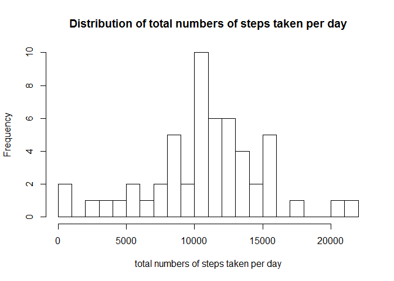
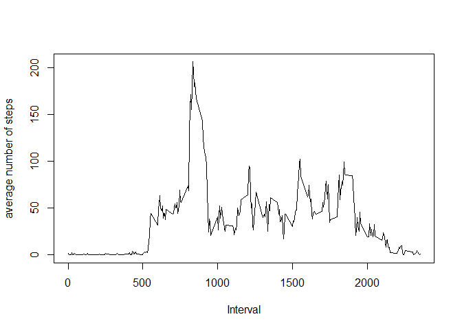
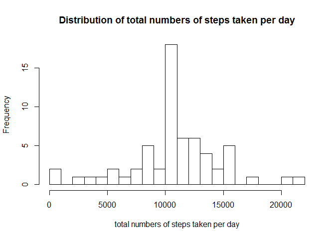
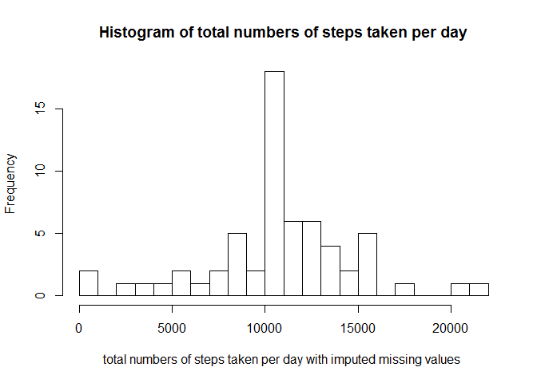

# Reproducible Research: Peer Assessment 1


## Loading and preprocessing the data

```r
unzip("activity.zip")
df <-read.csv("activity.csv")
```


## What is mean total number of steps taken per day?

```r
# calculate total number of steps taken per day
df_sum <- aggregate(steps ~ date, df, sum)
# make histogram of total number of steps taken per day
hist(df_sum$steps, xlab="total numbers of steps taken per day",main="Histogram of total numbers of steps taken per day",breaks=22)
```

 

```r
#Calculate and report the mean and median of the total #number of steps taken per day
ss<-summary(df_sum$steps)
ss
```

```
##    Min. 1st Qu.  Median    Mean 3rd Qu.    Max. 
##      41    8841   10760   10770   13290   21190
```

The mean total number of steps taken per day is
1.077\times 10^{4}
The median total number of steps taken per day is
1.076\times 10^{4}

## What is the average daily activity pattern?

```r
df_avg <- aggregate(steps ~ interval,df,mean)
# plot the time serie for average number of steps
plot(df_avg$interval,df_avg$step,type="l",xlab="Interval",ylab="average number of steps")
```

 

```r
# find 5-minute interval, on average across all the days 
# in the dataset, contains the maximum number of steps
subset(df_avg,df_avg$step == max(df_avg$steps))
```

```
##     interval    steps
## 104      835 206.1698
```

As shown in the plot, the average daily activity is peaked at 8:35 interval ( walking to work? ), and almost no activity between midnight and 5:00 am.

## Imputing missing values

```r
#Calculate and report the total number of missing values #in the dataset (i.e. the total number of rows with NAs)
steps <-df$step
length(steps[is.na(steps)])
```

```
## [1] 2304
```

```r
# fill the missing value with means of that 5 min inteval
df_complete <-df[complete.cases(df),]
df_na <-df[is.na(df$step),]
df_merge <-merge(df_avg,df_na,by="interval") # fill mean
df_impute <- subset(df_merge,select=c("steps.x","date","interval")) # only take the columns needed
names(df_impute)[1] <-"steps" # rename column
df_new <-rbind(df_complete,df_impute) # combine two
# Create new dataset that is equal to the original dataset # but with the missing data filled in.
df_new <- df_new[order(df_new$date,df_new$interval),] 
# calculate total number of steps taken per day
df_sum_new <- aggregate(steps ~ date, df_new, sum)
# make histogram of total number of steps taken per day
hist(df_sum_new$steps, xlab="total numbers of steps taken per day with imputed missing values ",main="Histogram of total numbers of steps taken per day",breaks=22)
```

 

```r
#Calculate and report the mean and median of the total #number of steps taken per day
ss_new <- summary(df_sum_new$steps)
ss_new
```

```
##    Min. 1st Qu.  Median    Mean 3rd Qu.    Max. 
##      41    9819   10770   10770   12810   21190
```

After fill in the missing values of steps with the average value of the interval, the newly calculated mean for the number of steps is 1.077\times 10^{4}, which does not change.While median for the number of steps 1.077\times 10^{4} is larger than the calculated mean with missing values. The impact of imputing missing data on the estimates of the total daily number of steps less biased.

## Are there differences in activity patterns between weekdays and weekends?

```r
#add weekdays column to df_new
df_new$weekdays <- weekdays(as.Date(df_new$date))
df_weekend <- subset(df_new, df_new$weekdays =="Saturday" | df_new$weekdays =="Sunday")
df_weekday <- subset(df_new, df_new$weekdays !="Saturday" & df_new$weekdays !="Sunday")
df_weekday_avg <-aggregate (steps ~ interval,df_weekday, mean)
df_weekend_avg <-aggregate (steps ~ interval,df_weekend, mean)
df_weekday_avg$weekdays <- c("weekday")
df_weekend_avg$weekdays <- c("weekend")
df_comb<- rbind(df_weekday_avg,df_weekend_avg)
#Create a new factor variable in the dataset with two #levels - "weekday" and "weekend"
df_comb$weekdays <- factor(df_comb$weekdays)
#Make a panel plot containing a time series plot for both 
# weekday and weekend
library(ggplot2)
qplot(interval, steps,data=df_comb,facets=weekdays~.,geom=c("line"),ylab="Number of steps")
```

 

The plots shows decreased activities in weekend comparing with weekdays.
